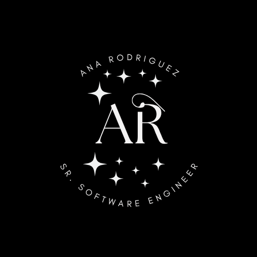
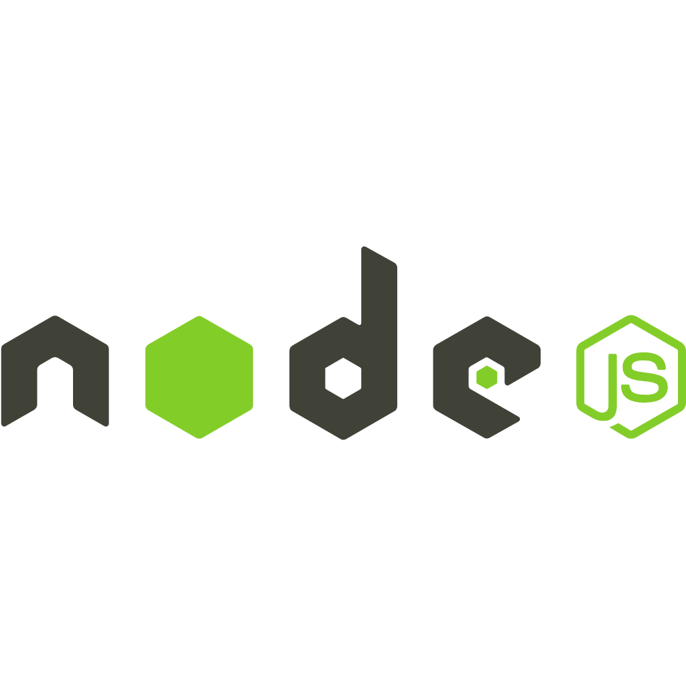
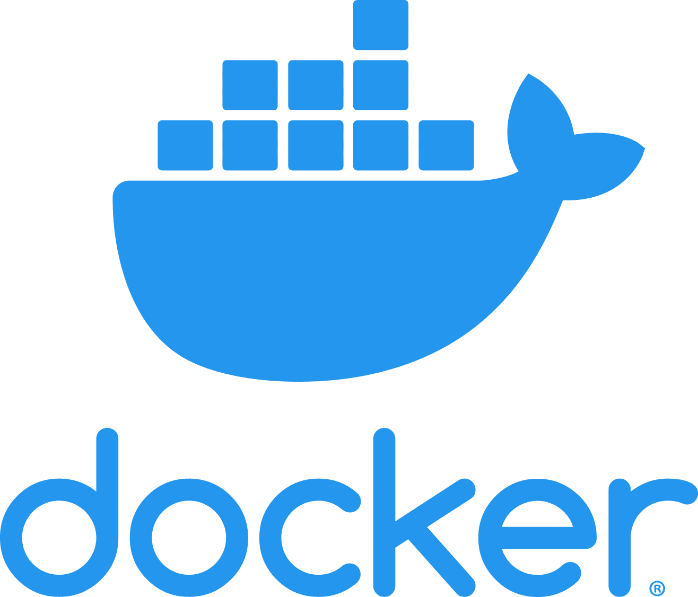
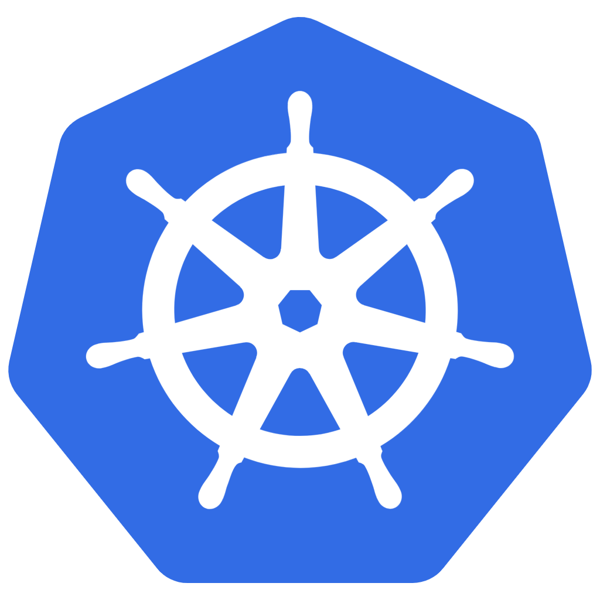
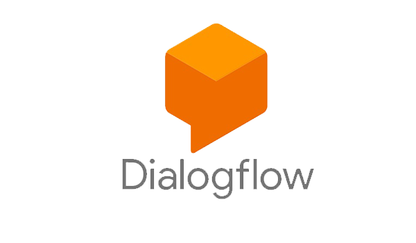

# Ana Rodriguez

Senior Software Engineer | BS Computer Science | MS Software Architecture

[ View Linkedin](https://www.linkedin.com/in/ana-rodriguez-mh/)
&nbsp;&nbsp;&nbsp;
[ View Website](https://anarodriguez.dev/)

---

 

With over 13 years of experience designing and developing scalable software solutions across diverse industries. I specialize in backend development, with strong expertise in building web applications, REST APIs, automation tools, Cron jobs, and chatbot solutions. Since 2012, I have collaborated with international, cross-functional teams in Agile environments (Scrum and Kanban), contributing to backend development, code reviews, deployments, CI/CD pipelines, software upgrades, migrations, decommissions, and technical documentation. I have also led small development teams and worked closely with stakeholders to deliver robust and maintainable solutions. 

 

In addition DevOps experience, including managing and troubleshooting CI/CD pipelines, Docker containers, and Kubernetes clusters, as well as monitoring with ArgoCD and Datadog. I have worked with serverless architectures and focused on ensuring code reliability, streamlining deployments, and optimizing delivery processes. I am recognized for being organized, proactive, and adaptable, which allows me to contribute effectively across multiple domains and technologies.

 

## Languages & Technologies

  
  
  
  
  
  
  
  
  
  
  
  
  
  
  
  
  
  
  
  
  

